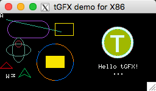
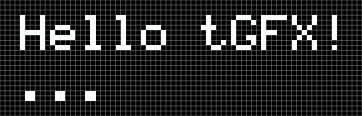

# tGFX [](https://travis-ci.com/LanFly/tGFX)



**a tiny gfx library for tft/lcd/oled screen. Platform independent. etc.. C51, STM32, Arduino, Linux, Windows, MacOSX.**

## Document

中文文档: http://timor.tech/project/tGFX

English: http://timor.tech/project/tGFX/en

## Issues

https://github.com/LanFly/tGFX/issues

## Test

There are no test cases now. But I will write it as soon as possible.

## Examples

[gfx-demo-x86](examples/gfx-demo-x86): This is tGFX demo for x86 on MacOSX or Linux using X11.

more [examples](examples/) are under development.

## Features

- Simple and light weight (**This is important**)
- Free and Open Source
- Font support
- Document support
- Cross platform
- No dependence
- Support canvas rendering
- Support real-time rendering (No canvas mode)
- Monochrome, 565, RGB, RGBA color support (under development)

## How to use Font

```c
#include "tGFX/565/font.h"
// use 5*8 bitmap font. Font Name: FONT_5X8
#include "tGFX/font/5x8.h"

tGFX_draw_text(canvas, 10, 110, "Hello tGFX!\n...", 16, &FONT_5X8, 0xffff);
```



## How to start

choose a color mode to use then include it.

example:

```c
#include "tGFX.h"
#include "tGFX/565/basic.h"

int main()
{
  // use 565 color canvas.
  tGFX_Canvas *canvas = tGFX_create_canvas(128, 128, tGFX_COLOR_MODE565);

  tGFX_draw_pixel(canvas, 63, 63, 0xffff);

  return 0;
}
```

## Real-Time mode (No canvas mode)

Use macro `tGFX_USE_REAL_TIME` to indicate that you want to use Real-Time mode.

CMakeLists.txt

```cmake
# using real-time drawing mode
add_compile_definitions(tGFX_USE_REAL_TIME)
```

example:

```c
#include "tGFX.h"
#include "tGFX/565/basic.h"

// TGFX will call this function in real time.
void tGFX_draw_pixel(tGFX_Canvas *canvas, uint16_t x, uint16_t y,
                     uint16_t color) {
  // overflow hidden.
  if (x > canvas->width || y > canvas->height) {
    return;
  }
  // you should drawing pixel(color) on position(x, y) here
}

int main()
{
  // use 565 color canvas.
  tGFX_Canvas ncanvas;
  // ref ncanvas
  tGFX_Canvas *canvas = &ncanvas;
  // use tGFX_init_canvas replace tGFX_create_canvas
  tGFX_init_canvas(canvas, 128, 128, tGFX_COLOR_MODE565);

  tGFX_draw_line(canvas, 10, 10, 100, 30, 0x35d3);

  return 0;
}
```

reference: [examples/gfx-real-time-demo-x86/](examples/gfx-real-time-demo-x86/)

## How to build

We recommend using CMake to build your program. But you can still compile it manually.

There are **2 parts of source code** that should be compiled into your program.

- `tGFX.c` is always needed. It provides the main `tGFX_create_canvas` functions.
- `src/tGFX/${color_mode}/*.c` also needed. It provides the set of drawing functions. example `tGFX_draw_pixel`.

And don't forget to set the include path to `/path/to/tGFX/include`.

## How to build with CMake

reference: [examples/gfx-demo-x86/CMakeLists.txt](examples/gfx-demo-x86/CMakeLists.txt)

CMake Options:

- tGFX_USE_COLOR_MODE
description: which color mode to use. Only one color mode can be used at the same time by default.
default value: 565

- tGFX_USE_TOOLS
description: whether to include tools source file.
default value: false

## How to develop and debug embedded program

tGFX is platform independent. So you can develop and debug drawings code on PC, such as MacOSX, Linux, Windows.

tGFX provides a demo of using X11 to debug drawings code on MacOSX. See [examples/gfx-demo-x86/README.md](examples/gfx-demo-x86/README.md) for details.

## How to contribution

Any kind of contribution is welcome, such as new features, improvement, bug fix, document, translations, examples.

tGFX is designed to be lightweight, fast, simple and independent. So we hope the code to be clean and friendly to read.

Here are a few things to follow:

- Code Style
please run `./scripts/run-clang-format.sh` before committing your PR.

## Font List

1. FONT_5X8


more font under development
